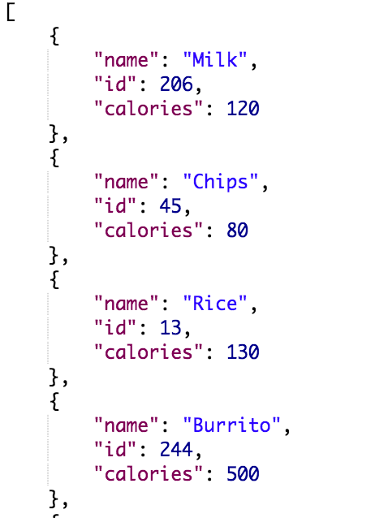
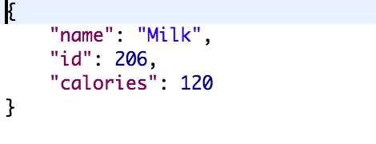
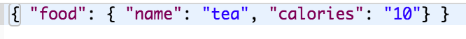
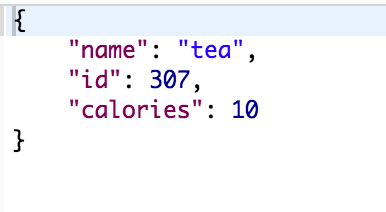
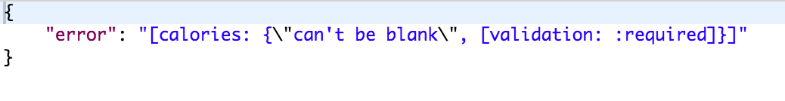
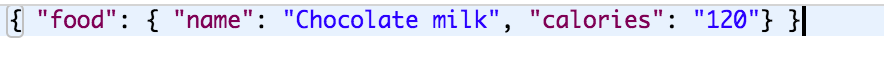
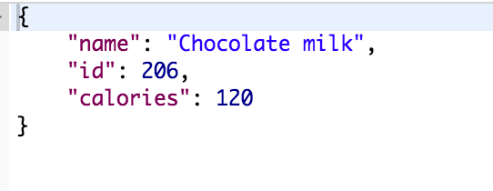

# Quantified Self Be

## Introduction
This is the back-end for our Quantified Self calorie counter app.

## Initial Setup

These instructions will get you a copy of the project up and running on your local machine for development and testing purposes.

From GitHub clone down repository using the following commands in terminal:
* `git clone git@github.com:Diazblack/quantified-self-be.git`
* `cd quantified-self-be`

## How to Use

### Running the Server Locally

To run the server locally run:
* `npm start`

In your browser visit:
* `http://localhost:8080/` to run your application.

## Endpoints
These are all the endpoints that can be hit.

### Food Endpoints
#### GET /api/v1/foods
This returns all foods currently in the database.  

Example output:

#### GET /api/v1/foods/:id
This returns a specific food when an id is passed in.  A 404 error is returned if the food is not found.

Example output:

#### POST /api/v1/foods
A new food can be created using the following format:

BOTH food name and calories must be sent in.

If successful, this returns the food item that is created. A 400 status is returned if not successful.  

Example successful response:

Example failed response:

#### PATCH /api/v1/foods/:id
This allows a food's name or calories to be updated.  
Changes should be sent in the following format:

If successfully updated, the updated food will be returned.  A status 400 code will be returned if not successful.

Example successful response:

#### DELETE /api/v1/foods/:id
This endpoint allows a food to be deleted.  A 204 status is returned if successful.  A 404 will be returned if the food id cannot be found.

### Meal Endpoints

## Known Issues

## Core Contributors
* Cesar Jolibois - Github: [Diazblack](https://github.com/Diazblack)
* Jennifer Lao - Github: [jplao](https://www.github.com/jplao)

## Built With

* [JavaScript](https://www.javascript.com/)
* [jQuery](https://jquery.com/)
* [Express](https://expressjs.com/)
* [Mocha](https://mochajs.org/)
* [Chai](https://chaijs.com/)

## Production

To view this project in production visit <https://quantified-self-533.herokuapp.com/api/v1/foods/>.

